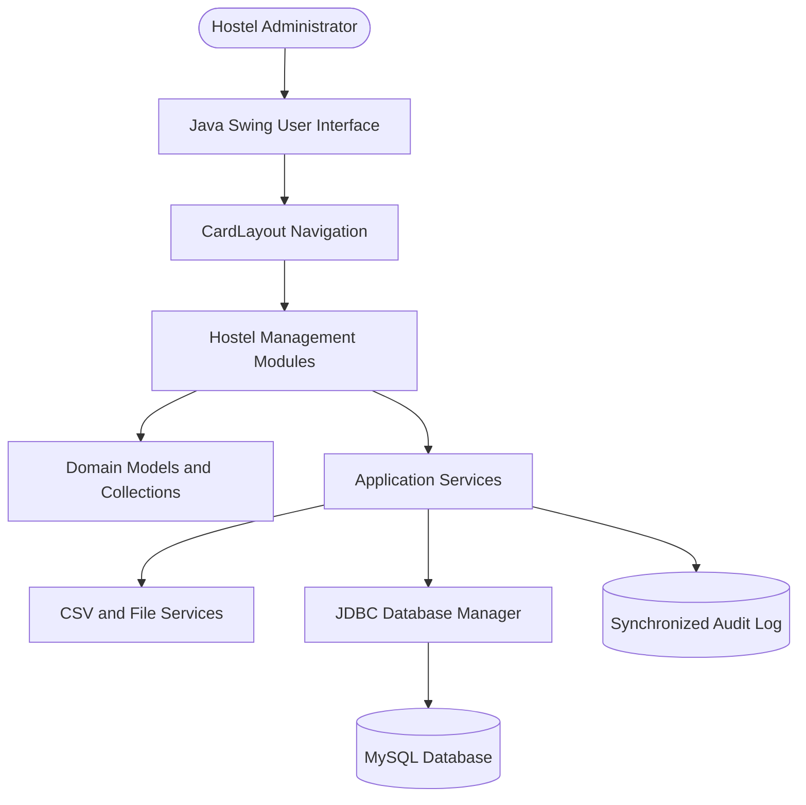
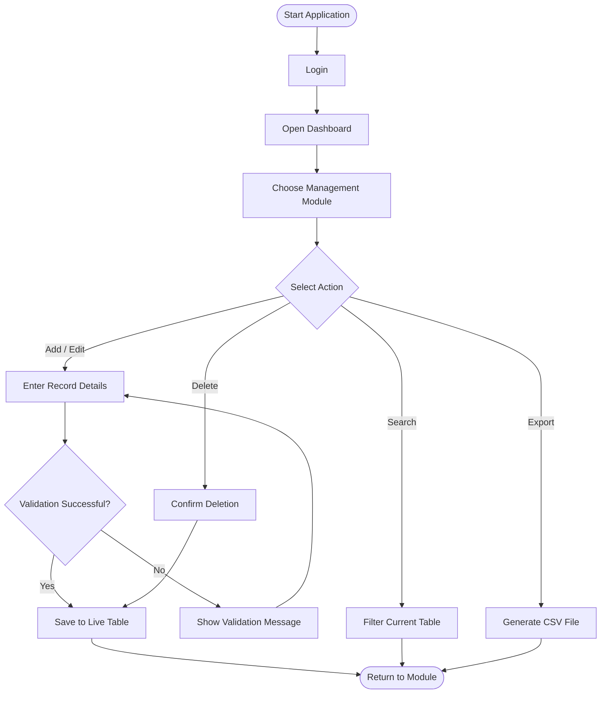

# Smart Hostel Management System

<div align="center">

### Modern Java Swing desktop software for college hostel operations


</div>

> One standalone application to manage students, rooms, fees, visitors, attendance, complaints, mess operations, outpasses, inventory, notices, staff, and reports.

## At a glance

| Purpose | Interface | Modules | Course alignment |
|---|---|---|---|
| Digitize hostel administration | Single-window Java desktop app | 13 operational modules | OOP, collections, threads, I/O, exceptions, JDBC |

<details>
<summary><strong>Contents</strong></summary>

- [Problem statement](#problem-statement)
- [Objectives](#objectives)
- [Features](#features)
- [Technology and Java concepts](#technology-and-java-concepts)
- [Architecture](#architecture)
- [Installation and running](#installation-and-running)
- [Testing](#testing)
- [Database design](#database-design)
- [Future enhancements](#future-enhancements)

</details>

## ⚠️ Problem statement

Hostel administration can become difficult when student details, room availability, fee records, visitor logs, complaints, and attendance are maintained in separate registers or spreadsheets. This project centralizes these operations in a simple, maintainable desktop application.

## 🎯 Objectives

- Maintain accurate hostel records through one local desktop application.
- Make daily hostel workflows faster through search, validation, reporting, and export.
- Apply Programming in Java syllabus concepts to a real-world business problem.
- Provide a clean foundation for future MySQL persistence.

## 👥 Target users

- Hostel warden and assistant warden
- Hostel office and security staff
- Mess, maintenance, and inventory staff
- College administrators

## ✨ Features

| Area | Included capabilities |
|---|---|
| 🎓 **Students** | Add, edit, delete, search, view profile, load sample students, assign room |
| 🛏️ **Rooms** | Capacity, occupancy, available beds, status, auto-allocation |
| 💳 **Fees** | Fee collection, paid/pending tracking, receipt preview, CSV export |
| 🛠️ **Complaints** | Register, assign to teams, update status, resolved tracking |
| 👤 **Visitors** | Entry/exit time, visitor pass preview, live status |
| 🕒 **Attendance** | Present/absent/late status, entry and exit time, late-entry report |
| 🍽️ **Operations** | Mess plans, outpass approvals, inventory and low-stock alerts |
| ⚙️ **Administration** | Notices, staff, reports, backup controls, theme and settings |
| 📊 **Dashboard** | Hostel statistics, custom charts, activities, quick actions, visitor overview |

## ✅ Functional requirements

| ID | Requirement |
|---|---|
| FR-01 | Add, edit, delete, search, and export management records. |
| FR-02 | Manage students, rooms, fees, complaints, visitors, attendance, mess, outpasses, inventory, notices, and staff. |
| FR-03 | Validate required fields before saving records. |
| FR-04 | Generate receipt and visitor-pass previews. |
| FR-05 | Export live records to CSV. |
| FR-06 | Support JDBC-ready MySQL connection, query, and update operations. |

## 🧩 Non-functional requirements

| Area | Requirement |
|---|---|
| Usability | Single-window Swing navigation, visible scrollbars, focus-clearing input hints, and clear validation. |
| Reliability | Exception handling for validation, file I/O, and JDBC; destructive actions require confirmation. |
| Maintainability | Modular domain, repository, database, file-service, and UI classes in one source file. |
| Performance | In-memory tables use responsive filtering; lightweight background work avoids UI blocking. |
| Security | Settings isolate credentials; production use should add password hashing and protected database credentials. |
| Logging | A synchronized singleton audit log records application actions. |

## 💻 Technology and Java concepts

- **Java Swing:** `JFrame`, `JPanel`, `CardLayout`, `JTable`, `JScrollPane`, `JOptionPane`, form components.
- **OOP:** classes, objects, constructors, encapsulation, inheritance, abstraction, interfaces, polymorphism, enums, nested classes, singleton.
- **Collections:** `ArrayList`, `Vector`, `Stack`, `Map`, `LinkedHashMap`, generics.
- **Exceptions:** custom validation exception, `try/catch`, multi-catch, `throws`, `IOException`, `SQLException`.
- **Multithreading:** daemon dashboard clock and synchronized audit logging.
- **File I/O:** CSV export, character streams, and byte-stream backup copying.
- **JDBC:** database connection, query, update, result processing, and close methods.
- **Advanced concepts:** arrays, recursion, annotations, reflection, anonymous classes, and runtime polymorphism.

## 🏗️ Architecture



## 🔄 Workflow



## 🚀 Installation and running

### Prerequisites 📋

- JDK 8 or later on Windows.
- Optional: MySQL Server and MySQL Connector/J for permanent database storage.

### Run ▶️

Open PowerShell in the folder containing `Main.java`, then run:

```powershell
javac -encoding UTF-8 Main.java
java Main
```

Demo login:

```text
Email: admin@hostel.com
Password: admin
```

## 🧪 Testing

1. Open **Students** and confirm sample students are visible.
2. Add a student, then edit and delete the selected record.
3. Search by student name and confirm table filtering works.
4. Export a module and verify the generated CSV contains current records.
5. Test **Auto Allocate** from Rooms.
6. Test fee receipt and visitor pass preview actions.
7. Check dashboard, tables, and sidebar scrollbars after resizing the window.
8. Open **Settings → Syllabus Concepts** to inspect executable Java concept examples.

## 🗄️ Database design

The current version stores editable records in memory for the running session and can export them as CSV. `DatabaseManager` is ready for MySQL integration.

| Table | Typical fields |
|---|---|
| `students` | student_id, name, course, room_no, phone, status |
| `rooms` | room_no, block, capacity, occupied, available, status |
| `payments` | receipt_no, student_id, amount, payment_mode, payment_date, status |
| `complaints` | ticket_no, student_id, subject, assigned_to, status |
| `visitors` | pass_no, visitor_name, student_id, entry_time, exit_time |
| `attendance` | attendance_id, student_id, attendance_date, entry_time, exit_time, status |

## ⚠️ Current limitations

- Data resets when the application closes unless exported to CSV.
- Permanent storage needs a configured MySQL server and JDBC driver.
- Production deployment should add authentication, hashed passwords, and role-based access control.

## 🔮 Future enhancements

- Complete MySQL CRUD persistence for every module.
- Secure user roles and password hashing.
- PDF reports and printing.
- Email/SMS notifications for fees, complaints, and outpasses.
- QR visitor passes and biometric attendance integration.
- Scheduled backups and audit-report downloads.

## 📁 Repository contents

```text
outputs/
├── Main.java     # Standalone Java Swing application
└── README.md     # Project documentation
