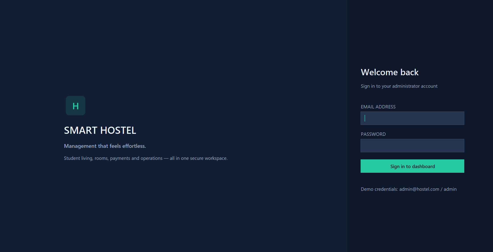
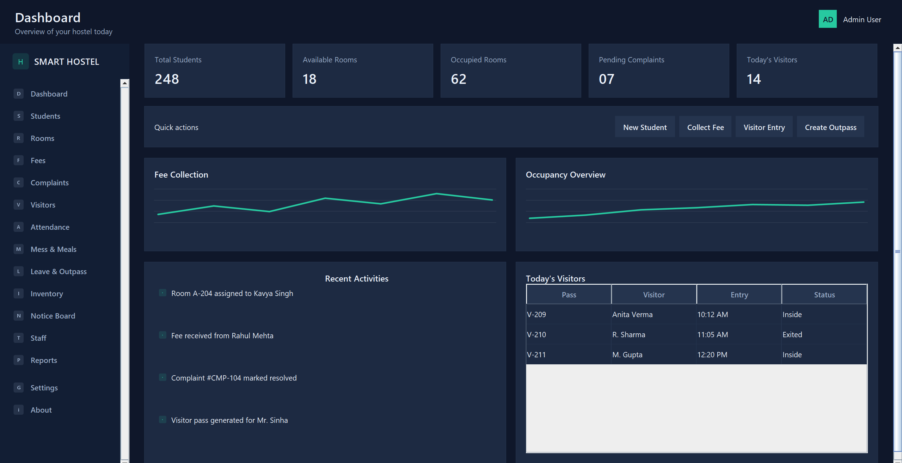
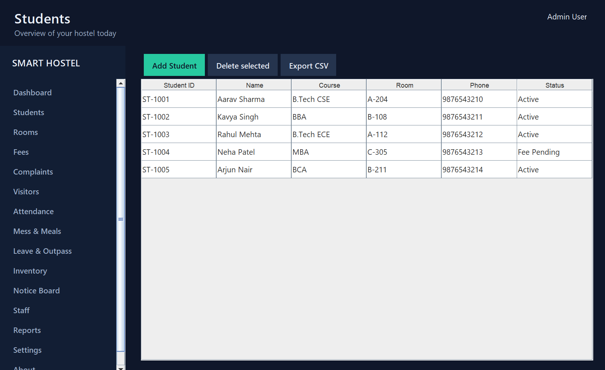
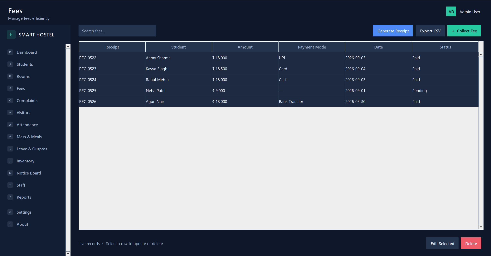

# 🏠 Smart Hostel Management System

<div align="center">

### ✨ Standalone Java Swing Desktop Application


</div>

## 🌟 Overview

Smart Hostel Management System is a single-file Java Swing desktop application designed to organize common college hostel activities in one place. It manages students, rooms, fees, complaints, visitors, attendance, mess plans, outpasses, inventory, notices, staff, reports, and settings through one modern desktop interface.

## ✨ Features

| Module | Main capabilities |
|---|---|
| 🎓 **Students** | Add, edit, delete, search, view profile, and assign rooms |
| 🛏️ **Rooms** | Capacity, occupancy, available beds, status, and auto allocation |
| 💳 **Fees** | Fee collection, pending payment tracking, receipt preview, and CSV export |
| 🛠️ **Complaints** | Register, assign teams, update status, and track resolution |
| 👤 **Visitors** | Entry/exit records and visitor-pass preview |
| 🕒 **Attendance** | Entry time, exit time, late-entry status, and reports |
| 🍽️ **Operations** | Mess, outpass, inventory, notices, staff, reports, and settings |
| 📊 **Dashboard** | Statistics, charts, activity, quick actions, and visitor overview |

> ✅ Includes validation, table search, editable live records, scrolling navigation, and CSV export.

## 💻 Technologies and tools used

- Java 8 or later
- Java Swing and AWT for the graphical user interface
- JDBC API for MySQL-ready database connectivity
- Java Collections Framework (`ArrayList`, `Vector`, `Stack`, `Map`)
- Java I/O streams for CSV export and file handling
- Multithreading, exception handling, reflection, annotations, and object-oriented programming

## 🚀 Installation and running

### 📋 Prerequisites

- JDK 8 or later installed on Windows
- Optional: MySQL Server and MySQL Connector/J for permanent database storage

### ▶️ Steps

1. Open PowerShell in the folder containing `Main.java`.
2. Compile the application:

   ```powershell
   javac -encoding UTF-8 Main.java
   ```

3. Run the application:

   ```powershell
   java Main
   ```

4. Sign in using the demo credentials:

   ```text
   Email: admin@hostel.com
   Password: admin
   ```

## 🧪 Testing instructions

1. Open **Students** and verify the sample student records are shown.
2. Add a student, edit the selected row, and delete a row to test CRUD operations.
3. Search for a student name to test table filtering.
4. Use **Export CSV** and verify that the saved file contains the current records.
5. Test **Auto Allocate** in Rooms.
6. Test the receipt preview in Fees and visitor pass preview in Visitors.
7. Resize the application and verify that the sidebar, dashboard, and tables can be scrolled.
8. Open **Settings → Syllabus Concepts** to view Java concept demonstrations.

## 📸 Screenshots

| Login | Dashboard |
|---|---|
|  |  |

| Students | Fees |
|---|---|
|  |  |

